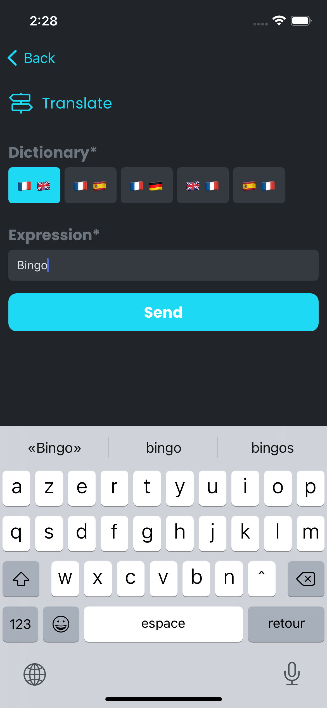
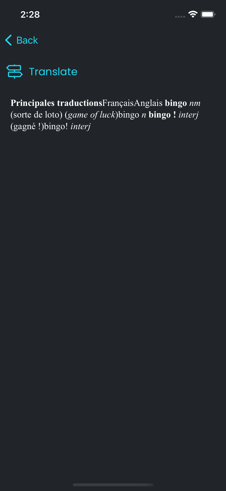

# Toolbox

🧪 This is an experiment 🧪.

## 📱 React Native

 Input                                 | Output
:-------------------------------------:|:------------------------------------:
  |

## 🕸 Web

Coming soon ⏳

## 💻 CLI

```sh
node index.js Translate --dictionary fren --expression Bingo
```

```html
<!DOCTYPE html>
<html>
    <head>
        <meta name="viewport" content="width=device-width, initial-scale=1">

        <style>

        </style>
    </head>
    <body>
        <tbody><tr class="wrtopsection"><td colspan="3" title="Principal Translations"><strong><span class="ph" data-ph="sMainMeanings">Principales traductions</span></strong></td></tr><tr class="langHeader" style="font-size: 13px;text-decoration: underline;font-weight:bold;"><td class="FrWrd"><span class="ph" data-ph="sLang_fr">Français</span></td><td></td><td class="ToWrd"><span class="ph" data-ph="sLang_en">Anglais</span></td></tr>
<tr class="even" id="fren:3120483"><td class="FrWrd"><strong>bingo</strong> <em class="POS2" data-lang="fr">nm</em></td><td> (sorte de loto)&nbsp;<span class="dsense">(<i>game of luck</i>)</span></td><td class="ToWrd">bingo <em class="POS2" data-lang="en">n</em></td></tr>
<tr class="odd" id="fren:3120484"><td class="FrWrd"><strong>bingo !</strong> <em class="POS2" data-lang="fr">interj</em></td><td> (gagné !)</td><td class="ToWrd">bingo! <em class="POS2" data-lang="en">interj</em></td></tr>
</tbody>
    </body>
</html>
```
